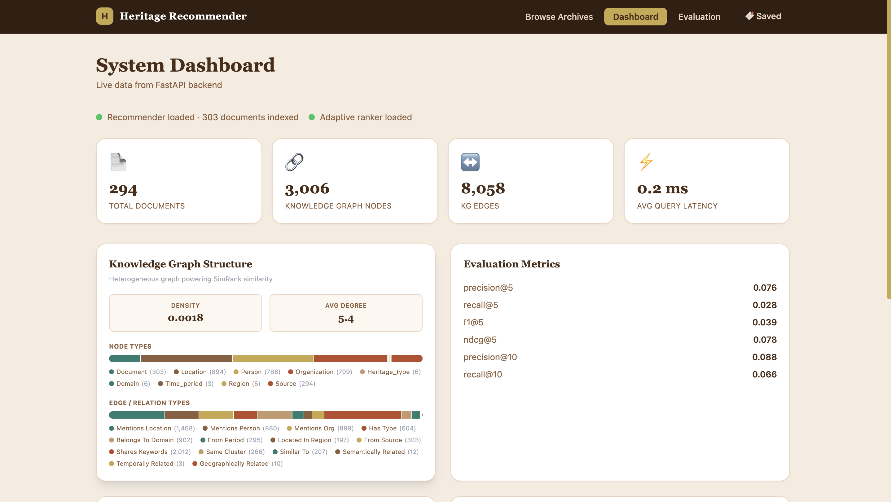

# Heritage Document Recommender

An intelligent heritage document recommendation system powered by Knowledge Graphs, semantic embeddings, and graph-based ranking — built to surface culturally relevant documents across global and Indian heritage corpora.

**Live Demo** → [heritagerec.vercel.app](https://heritagerec.vercel.app)

---

## Screenshots

**Landing Page**


**Browse & Search**


**Dashboard**


**Saved Documents**


**Evaluation Metrics**


---

## What it does

Takes a heritage-related query and returns semantically ranked documents using a pipeline of FAISS vector search, a Knowledge Graph (SimRank + Horn's Index), and a learned LambdaMART ranker — all served through a Next.js frontend backed by a FastAPI API.

---

## Tech Stack

| Layer | Tech |
|---|---|
| Frontend | Next.js 14, Tailwind CSS, Framer Motion |
| Backend | FastAPI, Python 3.11 |
| Embeddings | Sentence Transformers + FAISS |
| Knowledge Graph | NetworkX, SimRank, Horn's Index |
| Ranking | LambdaMART (LTR), Firework Algorithm |
| Data | Wikipedia, UNESCO, Indian Heritage, Archive.org |

---

## Architecture

```
Query
  └── FastAPI
        ├── FAISS vector search (semantic retrieval)
        ├── Knowledge Graph traversal (SimRank + Horn's Index)
        └── LambdaMART ranker (learned re-ranking)
              └── Ranked recommendations → Next.js UI
```

---

## Project Structure

```
heritage_doc_recomm/
├── api/                        # FastAPI backend
├── frontend/                   # Next.js app
│   ├── app/                    # App router pages
│   └── components/             # UI components
├── src/
│   ├── 1_data_collection/      # Wikipedia, UNESCO, Indian Heritage scrapers
│   ├── 2_preprocessing/        # Cleaning, balancing, gazetteer
│   ├── 3_representation/       # Embeddings + autoencoder
│   ├── 4_knowledge_graph/      # KG construction + FAISS indexing
│   ├── 5_ranking/              # LTR, LambdaMART, Firework optimizer
│   ├── 6_query_system/         # Query processor + recommender
│   └── 7_evaluation/           # Metrics, ground truth, reports
├── data/
│   ├── metadata/               # Enriched document metadata
│   ├── classified/             # Clustered documents
│   └── evaluation/             # Ground truth + results
├── knowledge_graph/            # KG weights, statistics, SimRank
├── models/ranker/              # FAISS indices + trained ranker weights
├── evaluation/                 # Evaluation reports
└── requirements.txt
```

---

## Getting Started

**Prerequisites:** Python 3.10+, Node.js 18+

```bash
# Clone
git clone https://github.com/aryananand-04/heritage_doc_recomm.git
cd heritage_doc_recomm

# Backend
python -m venv venv && source venv/bin/activate
pip install -r requirements.txt
python -c "import nltk; nltk.download('wordnet'); nltk.download('stopwords')"
uvicorn api.main:app --reload

# Frontend (separate terminal)
cd frontend
npm install
npm run dev
```

Open [http://localhost:3000](http://localhost:3000)

---

## Evaluation

The system is evaluated against a curated ground truth set using standard IR metrics:

| Metric | Score |
|---|---|
| Precision@5 | see `/evaluation` page |
| NDCG@10 | see `/evaluation` page |
| MAP | see `/evaluation` page |

Full evaluation report available at `/evaluation` on the live demo.

---

## Research Paper

This project is accompanied by a research paper detailing the methodology, Knowledge Graph construction, and ranking experiments.

> *Heritage Document Recommendation using Knowledge Graphs and Learning-to-Rank* — available on request.

---

## Contributors

<table>
  <tr>
    <td align="center">
      <a href="https://github.com/aryananand-04">
        <b>Aryan Anand</b>
      </a>
      <br/>
      <a href="mailto:aryananand.dev04@gmail.com">aryananand.dev04@gmail.com</a>
    </td>
    <td align="center">
      <a href="https://github.com/Akchhya1108">
        <b>Akchhya Singh</b>
      </a>
      <br/>
      <a href="mailto:akchhya.dev@gmail.com">akchhya.dev@gmail.com</a>
    </td>
  </tr>
</table>

---

## License

MIT
